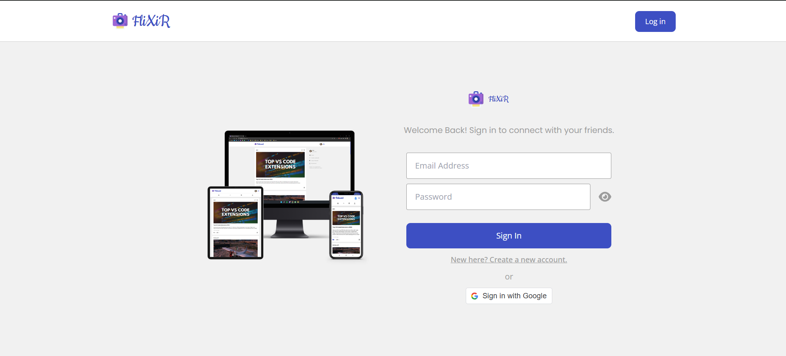
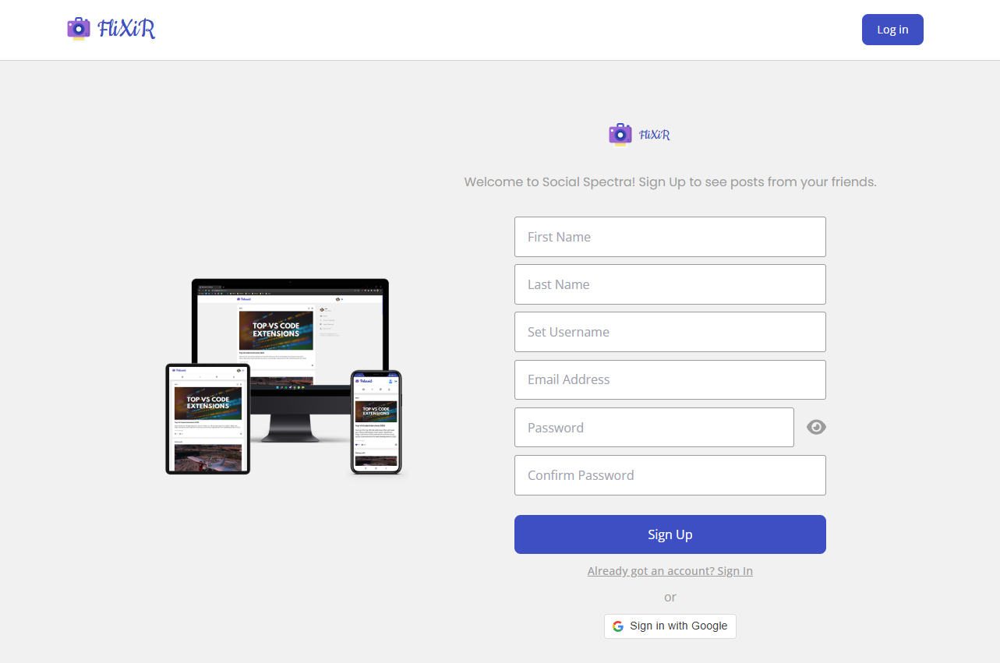
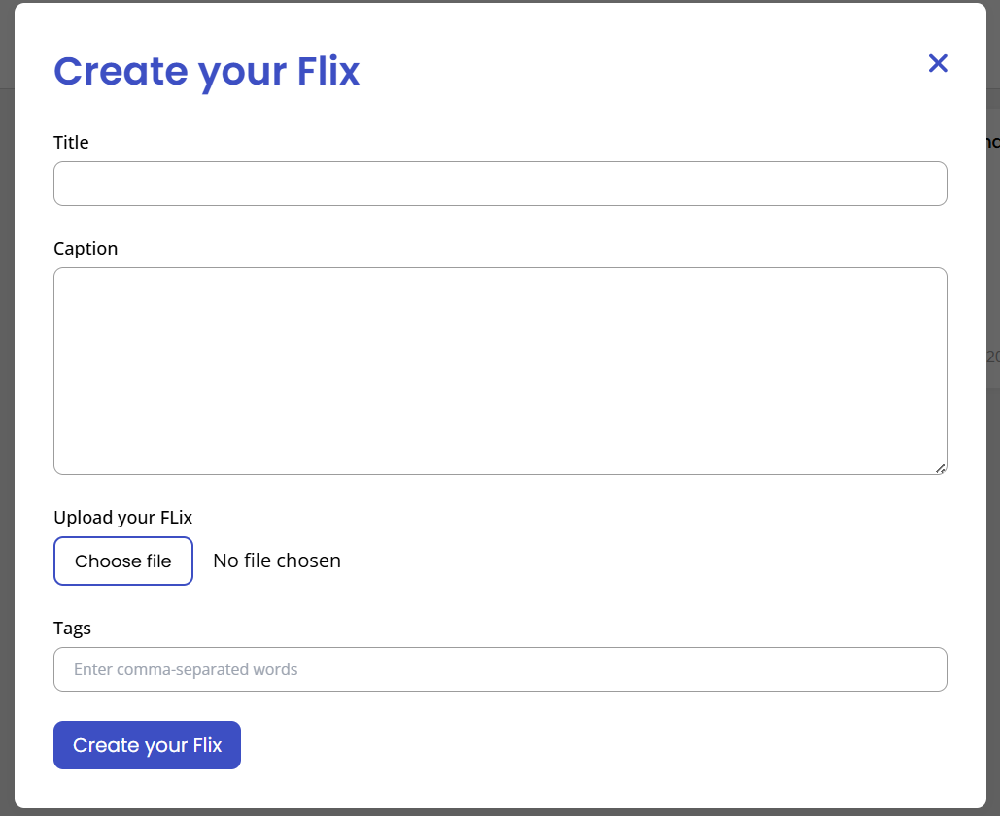
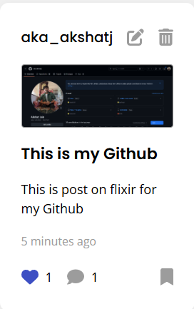
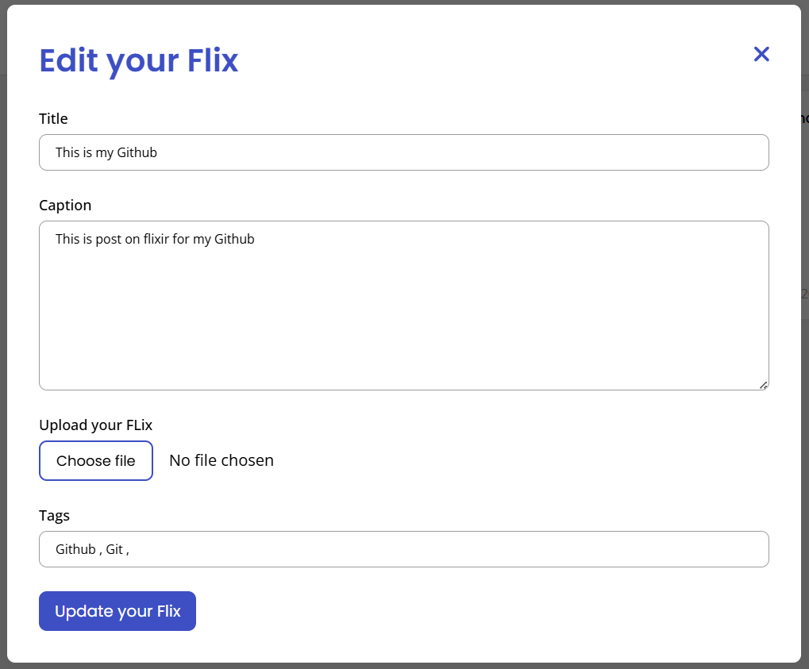
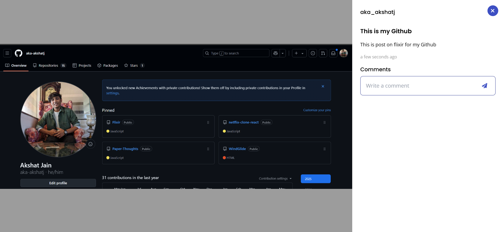

# Flixir - Social Media Web App

Flixir is a social media web application having CRUD functionalities.

<!-- <a href="https://polaroidapp.netlify.com"> -->
<!--  -->
</a>

 

## Goal of this project

The main purpose behind this project was to learn :

- Dividing the webpage into individual separate components
- Managing the global state of a complex application (Redux)
- Connecting the backend API with CRUD functionalities to a database (MongoDB)
- Authenticating users, hashing passwords(bcryptJS) and generating access tokens (JWT)
- Connecting the frontend and the backend together

 

## Features and Interfaces

1. Authentication Page

   - The user is first greeted with the login screen. If he/she had manually created their account then they will have to login using username and password. If they had signed up using Google then they can login using Google
     

   - If the user is a first time visitor, they can create their account or signup using Google
     

 

2. Homepage
   - The homepage shows all the posts of all the users on the left section and the menu on the right section.
   - The navbar has the logout button.

 

3. Menu

   - `Home` : Takes the user to the homepage if the user is logged in. If the user is not logged in or login token has expired, the user is taken to the authentication page when they click on the `Home` button

   - `Create a polaroid` : Opens up a modal for the user to upload a post.
     

 

4. Post
   - The top section has the username and the edit and delete icons (only for the posts created by the user)
      
     
   - The edit button opens up the modal with the previous data already populated.
      
     
   - The delete button simply deletes that post
   - The bottom section of the post contains the like button and the comment button.
   - Clicking on the post opens up the post page. Users can comment here.
     

 

## Tech Stack

- Frontend:
  1. `React` - Styling
  2. `Redux` - State management
  3. `Netlify` - Hosting frontend

 

- Backend:
  1. `Node and Express` - Server and API
  2. `Google OAuth` - Google sign in
  3. `MongoDB and Mongoose` - Database for storing user information and posts
  4. `Netlify` - Frontend Hosting
  4. `Heroku` - Hosting backend

## Environment Setup

1. Clone the repository using `git clone https://github.com/aka-akshatj/Flixir.git `
2. Install all the node dependencies `npm install`
4. Replace Google OAuth ID and MongoDB Atlas keys with your configurations
5. Replace axios `baseURL` in frontend > src > api > index.js with `http://localhost:5000/`
6. Run `npm start` in the backend directory to start the backend server at `http://localhost:5000`
7. Run `npm start` in the frontend directory to start the frontend server at `http://localhost:3000/`
8. Be sure to start the backend before the frontend.
